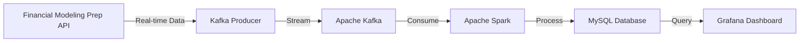

# Real-time Financial Data Processing Pipeline

A real-time financial data processing pipeline that performs in big data processing, stream processing, and data visualization. This project shows a production-grade system that processes real-time stock market data using modern data engineering practices and tools.

## Features

- **Real-time Data Ingestion**: Streams live stock market data from Financial Modeling Prep API
- **Distributed Processing**: Uses Apache Spark for scalable data processing
- **Message Queue**: Implements Apache Kafka for reliable data streaming
- **Data Persistence**: Stores processed data in MySQL for historical analysis
- **Visualization**: Real-time dashboards using Grafana
- **Containerization**: Fully containerized using Docker for easy deployment
- **Monitoring**: Built-in monitoring and alerting capabilities
- **Scalability**: Designed to handle high-volume data streams

## Architecture



### Components

- **Kafka Producer**: Python-based service that fetches real-time stock data
- **Apache Kafka**: Distributed streaming platform for data ingestion
- **Apache Spark**: Distributed computing engine for real-time data processing
- **MySQL**: Relational database for data persistence
- **Grafana**: Visualization platform for real-time analytics

## Technology Stack

- **Stream Processing**: Apache Kafka, Apache Spark
- **Database**: MySQL
- **Visualization**: Grafana
- **Containerization**: Docker, Docker Compose
- **Programming**: Python 3.8+
- **API Integration**: Financial Modeling Prep API ([get key here](https://site.financialmodelingprep.com/))

## Getting Started

1. **Clone the Repository**
   ```bash
   git clone https://github.com/devraj-raghuvanshi/financial-data-processing.git
   cd financial-data-processing
   ```

2. **Environment Setup**
   ```bash
   chmod +x setup_environment.sh
   ./setup_environment.sh
   ```

3. **Configure Environment Variables**
   ```bash
   cp .env_template .env
   # Edit .env with your configuration
   ```

4. **Launch the Pipeline**
   ```bash
   docker-compose up --build
   ```

## Configuration

### Environment Variables
Key configuration options in `.env`:
- `FMP_API_KEY`: Your Financial Modeling Prep API key
- `MYSQL_ROOT_PASSWORD`: Database root password
- `GRAFANA_ADMIN_PASSWORD`: Grafana admin password

### Customization
- Modify `grafana/stock_data_dashboard.json` for custom visualizations
- Adjust `spark/process_data.py` for different data processing logic
- Update `kafka/kafka_producer.py` for alternative data sources

## License

This project is licensed under the MIT License - see the [LICENSE.txt](LICENSE.txt) file for details.
